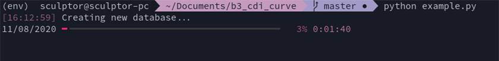

# B3 CDI Curve by Fluxonaut

This package is a collection of Python scripts that extracts, consolidates and interpolates data from the Brazilian CDI Curve provided on the B3 Exchange web site.
It allows you to produce a historical data series for any given duration (considering it respects the maximum available duration). It stores all the term structure of the CDI curve in a local SQLite database as well.

## Setup and usage

Just install from PyPi as shown below.

```bash
pip install b3-cdi-curve
```

Now just import it to your project. The package exposes two methods, **sync_db()** and **create_time_series(duration: int)**.
Below you can find a basic usage example and a more detailed explanation.

```python
import b3cdi

# Create and/or update local DB
b3cdi.sync_db()

# Create time series for the desired duration
b3cdi.create_time_series(360)
```


### **sync_db**

This method loops through all the dates between the beginning of the series and the last working day looking for the prices on the B3 web site. It then generates and saves a local SQLite database (located on ./output/cdi.db).

**The first run takes around two and half hours to build the database (respecting the minimum delay for requests) and it takes around 1.35 GB of disk space.**

After it runs once, it'll check for the last inserted date, so it'll look only for working days after the last update. This keeps the database updated for each time you run the code.

### **create_time_series**

```python
create_time_series(duration: int)
```

This method queries the local database to produce a Pandas DataFrame with the historical series of the requested duration. It then saves it as a CSV file on the ./output/ folder.
**The parameter of the method is where you input your desired duration (e.g. 360).**

## Contributing
Pull requests are welcome. Please open an issue first to discuss what you would like to change.

## To-do
- [ ] Tests
- [ ] Optimize db size

## Fluxonaut
This code was made possible by the amazing people working at Fluxonaut who dedicated their free time to help the community. Please be sure to check our our website at https://fluxonaut.com.

## License
This project is under the [MIT](https://opensource.org/licenses/MIT) license.
